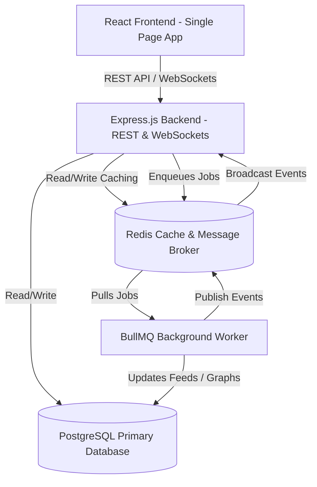
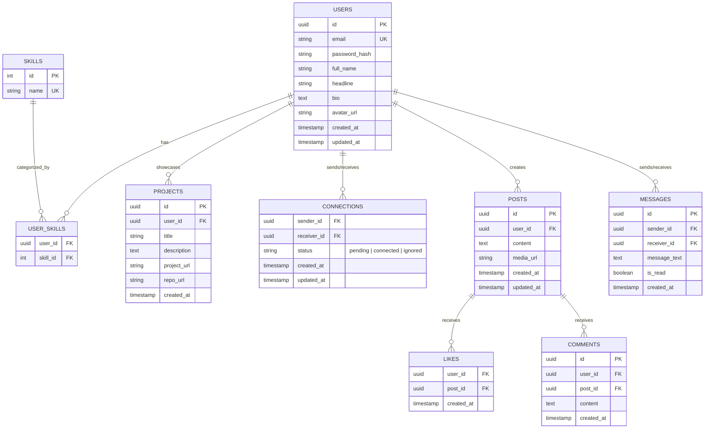

# Professional Networking Platform with Intelligent Recommendations

An 8-week detailed development roadmap and system architecture plan for a scalable professional networking platform tailored for developers. The roadmap is structured Monday-to-Monday to align with weekly progress evaluation meetings, ensuring a demo-ready deliverable is presented every Monday.

---

## Technical Architecture Recommendations

### 1. Technology Stack
*   **Frontend**: React.js SPA (created via Vite for rapid development and optimized builds) styled with modern, responsive CSS Modules (or TailwindCSS if requested).
*   **Backend**: Node.js with Express.js using ES Modules for clean structure.
*   **Database**: PostgreSQL for robust relational data, complex joins, and recursive graph traversal queries.
*   **ORM/Query Builder**: Prisma or Knex.js for structured migrations and strongly-typed queries.
*   **Caching & Session Storage**: Redis for caching user feeds, storing session data, and implementing Socket.io's pub/sub adapter for horizontal scalability.
*   **Real-Time Layer**: Socket.IO for WebSocket communication (DMs, notifications, and live alerts).
*   **Asynchronous Workers**: BullMQ (backed by Redis) for running background tasks like feed rankings, graph updates, and email/notification queues.

### 2. System Architecture Design
A standard multi-tier design ensures separating data concerns, business logic, and presentation logic:

---

## Database Design (Schema)

To capture relationships, user profiles, feed metrics, and messaging, the PostgreSQL database is structured with appropriate indexes to avoid query bottleneck:

### Database Optimization & Indexing Strategy
*   **Compound Index** on `CONNECTIONS(sender_id, receiver_id)` to speed up relationship check queries.
*   **Single-Column Index** on `CONNECTIONS(status)` to quickly filter connections.
*   **Single-Column Index** on `POSTS(created_at DESC)` to fetch chronological feeds.
*   **Full-Text Search Index** on `POSTS(content)` and `USERS(full_name, headline)` for user search and trending content query.

---

## 8-Week Development Roadmap (Monday-to-Monday)

The internship runs from **25 May 2026 to 20 July 2026**. Each week begins on Monday and culminates with a demo/review the following Monday.

---

### **Week 1: Project Setup, Database Foundations, and Profiles**
*   **Date Range**: 25 May 2026 – 01 June 2026
*   **Weekly Objectives**: Establish repository infrastructure, provision PostgreSQL, deploy JWT auth backend, and build profile management UI.
*   **Research & Planning**: 
    *   Decide on state management library (e.g. React Context vs Redux Toolkit).
    *   Create REST API conventions (consistent response and error formats).
*   **Development Tasks**:
    *   Initialize backend structure (Express.js structure, DB connection pool setup).
    *   Implement user registration, login, and token-based (JWT) authentication flow.
    *   Create profile CRUD APIs (Headline, Bio, Profile Image upload to mock storage or Cloudinary).
    *   Build login, sign-up, and profile setting screens on the React frontend.
*   **Testing & Debugging**:
    *   Verify API routes with Postman/Swagger.
    *   Unit test registration password hash strength and token expiration.
*   **Documentation**: Write standard API schema definitions (OpenAPI/Swagger spec) and repository setup guide.
*   **Monday Review (01 Jun 2026) Deliverables**:
    *   Live demo of JWT authentication flow (sign up -> login -> redirected to profile).
    *   Functional Profile edit screen where bio, skills list, and avatar can be saved.
    *   Visual diagram of current backend folder organization.

---

### **Week 2: Social Graph & Connection Management**
*   **Date Range**: 01 June 2026 – 08 June 2026
*   **Weekly Objectives**: Build the relational social network backend and create interactive UI to request and accept connections.
*   **Research & Planning**:
    *   Study recursive SQL queries (Common Table Expressions) to fetch connection levels (1st, 2nd, 3rd degree).
*   **Development Tasks**:
    *   Design and run migrations for the `CONNECTIONS` table.
    *   Develop Connection APIs: `sendRequest`, `acceptRequest`, `rejectRequest`, and `getConnections`.
    *   Create frontend Dashboard featuring two lists: "My Connections" and "Pending Requests".
    *   Build simple global user search mechanism to discover developers to connect with.
*   **Testing & Debugging**:
    *   Verify edge cases: sending duplicate connection requests, connection request to oneself, and cyclic connection statuses.
*   **Documentation**: Update DB architecture diagram with connection logic details.
*   **Monday Review (08 Jun 2026) Deliverables**:
    *   Inter-user networking flow: User A sends connection request to User B, and User B logs in, sees it, and accepts it.
    *   Connections Count indicator on User profile dashboard showing 1st degree contacts.

---

### **Week 3: Tech Posts & Personalized Content Feed**
*   **Date Range**: 08 June 2026 – 15 June 2026
*   **Weekly Objectives**: Enable users to post rich text posts, interact with them (likes/comments), and view a compiled chronological feed.
*   **Research & Planning**:
    *   Research image compression techniques prior to file uploads.
    *   Analyze feed delivery strategies: Push vs Pull model (Pull is recommended for initial scale).
*   **Development Tasks**:
    *   Build REST endpoints for `createPost`, `deletePost`, `likePost`, and `addComment`.
    *   Integrate simple image upload capability (stored locally or Cloudinary).
    *   Create dynamic client-side Post Component featuring layout support for text, images, Like button, and a collapsible Comment Section.
    *   Build main Feed page aggregation logic (posts written by 1st-degree connections and user themselves).
*   **Testing & Debugging**:
    *   Ensure posts render dynamically without full page reloads upon creation, deletion, or like triggers.
*   **Documentation**: Document media storage and retrieval flow.
*   **Monday Review (15 Jun 2026) Deliverables**:
    *   Fully functional Feed page showcasing post sharing, dynamic "Like" count updating via API, and nested post comment capability.

---

### **Week 4: Intelligent Graph Recommendations ("People You May Know")**
*   **Date Range**: 15 June 2026 – 22 June 2026
*   **Weekly Objectives**: Code the core recommendation engine using graph traversals to recommend developers based on shared skills and mutual connections.
*   **Research & Planning**:
    *   Design weighting schema for recommendation algorithms:
        *   Weight 1: Second-degree connection (friend of friend).
        *   Weight 2: Shared skills (e.g. both know React).
*   **Development Tasks**:
    *   Write optimized PostgreSQL query using recursive CTEs to identify second-degree connections.
    *   Implement user matching score calculation algorithm (e.g., Jaccard similarity or simple counts).
    *   Build `getRecommendations` API that serves a prioritized list of users.
    *   Create a "People You May Know" carousel on the React client side.
*   **Testing & Debugging**:
    *   Verify recommendations with mock data profiles containing diverse networks to assert scoring accuracy.
*   **Documentation**: Write a technical document detailing the mathematical logic of the recommendation algorithm.
*   **Monday Review (22 Jun 2026) Deliverables**:
    *   Dashboard widget displaying "People You May Know" containing matching reasoning (e.g. "React developer", "3 mutual connections") and quick "Connect" actions.

---

### **Week 5: Real-Time Chat & Live Notifications**
*   **Date Range**: 22 June 2026 – 29 June 2026
*   **Weekly Objectives**: Integrate Socket.IO into backend and frontend to enable real-time messaging, chat history logs, and instant notifications.
*   **Research & Planning**:
    *   Evaluate socket reconnection states and secure authentication during Socket.IO handshakes.
*   **Development Tasks**:
    *   Create WebSocket server layer alongside Express REST application.
    *   Design real-time handlers for message transfer and live notifications.
    *   Save chat messages to PostgreSQL for persistent history.
    *   Build Chat UI overlay enabling instant messaging between connected peers.
    *   Integrate Notification bell in the navbar showcasing connection requests and post likes.
*   **Testing & Debugging**:
    *   Test WebSocket disconnects, message receipt confirmations, and multi-tab notification synchronization.
*   **Documentation**: Design a WebSockets events mapping sheet.
*   **Monday Review (29 Jun 2026) Deliverables**:
    *   Interactive demo with two browser windows showing instant real-time text exchange (chat) and real-time push alerts without page refreshes.

---

### **Week 6: Search, Tagging, and Trending Topics**
*   **Date Range**: 29 June 2026 – 06 July 2026
*   **Weekly Objectives**: Add hashtag extraction in posts, track trending technology terms, and implement text searches.
*   **Research & Planning**:
    *   Explore regex parsing for text tokenization.
    *   Examine Redis sorted sets (`ZSET`) to store and calculate trending topics within moving windows.
*   **Development Tasks**:
    *   Create post-processor middleware to detect and store hashtags (e.g. `#react`, `#nodejs`) on post creation.
    *   Implement Redis/Database tracking structure to log hashtag frequency over a sliding window (e.g., last 48 hours).
    *   Build Search API supporting fuzzy name match, skill filter, and hashtag lookups.
    *   Build search results layout and "Trending Topics" widget on frontend dashboard sidebar.
*   **Testing & Debugging**:
    *   Analyze search execution speeds and configure database indexes on text search columns.
*   **Documentation**: Outline data lifecycle and indexing structures for search optimization.
*   **Monday Review (06 Jul 2026) Deliverables**:
    *   Global search functionality displaying filtered search outputs (e.g., finding all users who have the skill "PostgreSQL").
    *   "Trending Now" sidebar list populated automatically based on most popular post hashtags.

---

### **Week 7: Project & Hackathon Collaboration Hub**
*   **Date Range**: 06 July 2026 – 13 July 2026
*   **Weekly Objectives**: Build collaborative showcase sections where users can create projects/hackathons and recruit connection collaborators.
*   **Research & Planning**:
    *   Define data specifications for project collaboration cards (roles needed, duration, skill requirements).
*   **Development Tasks**:
    *   Expose CRUD API endpoints for collaborative projects and registration management.
    *   Design backend matching filter displaying projects looking for user's skills.
    *   Create "Collabs Hub" UI displaying project profiles, matching badges, and an interactive "Apply to Collaborate" workflow.
*   **Testing & Debugging**:
    *   Test collaboration request notification and confirmation loops.
*   **Documentation**: Write a developer-facing user guide explaining collaboration creation.
*   **Monday Review (13 Jul 2026) Deliverables**:
    *   Functional "Collabs Hub" showcasing active hackathons/projects, matching percentage indicators, and request submission to join.

---

### **Week 8: Performance Tuning, Deployment, and Final Presentation**
*   **Date Range**: 13 July 2026 – 20 July 2026
*   **Weekly Objectives**: Optimize queries, configure caching mechanisms, deploy to public servers, and prepare final assessment assets.
*   **Research & Planning**:
    *   Evaluate hosting options (Render, Railway, or AWS Free Tier).
*   **Development Tasks**:
    *   Add Redis caching layer to user feed retrieval endpoint (`getFeed`) with cache-invalidation on new posts.
    *   Containerize application with multi-stage Dockerfiles.
    *   Set up automated cloud deployment configuration (e.g. Frontend on Vercel/Netlify, Backend + PostgreSQL + Redis on Render/Railway).
    *   Prepare final presentation deck, project report, and demo video.
*   **Testing & Debugging**:
    *   Run basic load tests using tools like Autocannon or Artillery to document API latency.
*   **Documentation**: Complete system installation manual and code commentary documentation.
*   **Monday Review (20 Jul 2026) Deliverables**:
    *   Deployed application running on a public production URL.
    *   Load testing and response time comparison report (with vs. without Redis caching).
    *   Final internship presentation deck and academic/professional report.

---

## Deliverables Summary

| Date | Monday Evaluation Milestone | Demo/Review Deliverables |
|---|---|---|
| **01 Jun 2026** | **Week 1 Milestone** | Auth flows, interactive profile settings, and OpenAPI docs. |
| **08 Jun 2026** | **Week 2 Milestone** | Real-time connections sent/received/accepted visual interface. |
| **15 Jun 2026** | **Week 3 Milestone** | Chronological feed, dynamic post composer, likes/comments module. |
| **22 Jun 2026** | **Week 4 Milestone** | Recommendation algorithm live output ("People You May Know"). |
| **29 Jun 2026** | **Week 5 Milestone** | Live chat messaging (WebSocket interface) & in-app alerts. |
| **06 Jul 2026** | **Week 6 Milestone** | Core platform search capabilities and Redis-based Trending widget. |
| **13 Jul 2026** | **Week 7 Milestone** | Collaboration Hub for hackathons and team-matching page. |
| **20 Jul 2026** | **Week 8 Milestone** | Production URL, load test report, final presentation slide deck. |

---

## Open Questions

> [!IMPORTANT]
> 1. Do you have access to a specific database hosting service, or should we use free hosting tiers (e.g., Railway/Render) for all cloud deployments?
> 2. Should we implement Docker Compose configuration in Week 1 to keep the local development of PostgreSQL and Redis encapsulated, or do you have these services running locally already?
